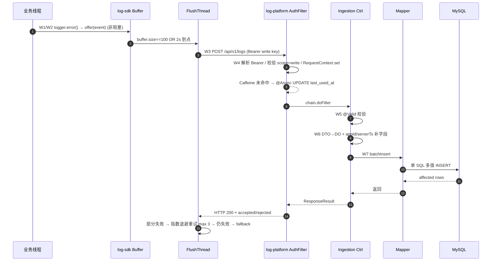
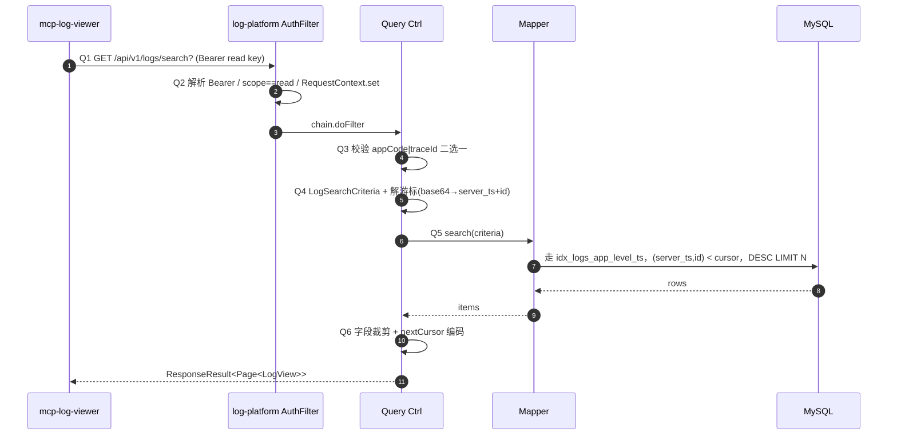
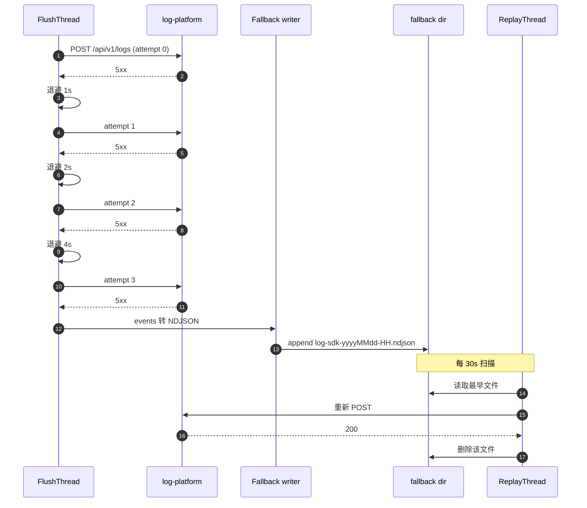

# REQ-2026-001 · 详细设计（detail-design）

> 本文承接 `outline-design.md`，把 §7 移交的全部未决项落到「字段级 / 接口级 / 线程级」可实施粒度，供 task-planning 拆 feature 与 development 直接落码。

## 0. 阅读地图

| 你想知道 | 看哪一节 |
|---|---|
| 三表 SQL 长什么样 | §1 数据库设计 |
| 八个 endpoint 的请求/响应 | §2 REST 接口设计 |
| 错误码全集 | §3 错误码字典 |
| 鉴权 + RequestContext + Caffeine 节流怎么实现 | §4 鉴权与跨切面 |
| 日志怎么写、MDC 字段、脱敏 | §5 日志规范 |
| SDK 内部线程模型与降级 | §6 log-sdk 详细设计 |
| 配置项全集（服务端 + SDK） | §7 配置项清单 |
| 部署/启动相关（admin token、.env） | §8 部署与运行 |
| 写入与查询时序图 | §9 时序图 |
| 跨仓 PR 模板 / OpenAPI / `_archive/` 兼容 | §10 工程治理 |

## 1. 数据库设计

### 1.1 全局约定

- 字符集：`utf8mb4` / `utf8mb4_general_ci`
- 引擎：`InnoDB`
- 时间字段：`DATETIME(3)`（毫秒精度），存 UTC，应用层（Spring）按需转本地时区
- 主键：`BIGINT AUTO_INCREMENT`
- 所有表带 `created_at` / `updated_at`，`updated_at` 走 `ON UPDATE CURRENT_TIMESTAMP(3)`
- 枚举字段一律 `VARCHAR` + 代码层校验（不用 MySQL ENUM，迁移友好）

### 1.2 三张表 DDL（落位 `log-common/src/main/resources/db/schema.sql`）

```sql
-- ========== app_registrations ==========
CREATE TABLE `app_registrations` (
  `id` BIGINT UNSIGNED NOT NULL AUTO_INCREMENT,
  `code` VARCHAR(64) NOT NULL COMMENT '业务编码，全局唯一，例：order-service',
  `name` VARCHAR(128) NOT NULL COMMENT '展示名',
  `owner` VARCHAR(64) NOT NULL COMMENT '负责人或团队',
  `environment` VARCHAR(16) NOT NULL COMMENT '枚举：dev/staging/prod',
  `status` VARCHAR(16) NOT NULL DEFAULT 'active' COMMENT '枚举：active/disabled',
  `created_at` DATETIME(3) NOT NULL DEFAULT CURRENT_TIMESTAMP(3),
  `updated_at` DATETIME(3) NOT NULL DEFAULT CURRENT_TIMESTAMP(3) ON UPDATE CURRENT_TIMESTAMP(3),
  PRIMARY KEY (`id`),
  UNIQUE KEY `uk_app_code` (`code`)
) ENGINE=InnoDB DEFAULT CHARSET=utf8mb4 COMMENT='应用注册表';

-- ========== api_keys ==========
CREATE TABLE `api_keys` (
  `id` BIGINT UNSIGNED NOT NULL AUTO_INCREMENT,
  `app_id` BIGINT UNSIGNED NOT NULL COMMENT '软引用 app_registrations.id（不建 FK，写入热路径无跨表锁）',
  `key_prefix` CHAR(8) NOT NULL COMMENT '明文前 8 位，仅供管理员辨识（脱敏展示）',
  `key_hash` CHAR(64) NOT NULL COMMENT 'SHA-256(明文) 16 进制小写',
  `scope` VARCHAR(8) NOT NULL COMMENT '枚举：write/read',
  `label` VARCHAR(64) DEFAULT NULL COMMENT 'R5：自定义描述，例 order-service-write-prod',
  `status` VARCHAR(16) NOT NULL DEFAULT 'active' COMMENT '枚举：active/revoked',
  `last_used_at` DATETIME(3) DEFAULT NULL COMMENT 'AuthFilter 写入；Caffeine 60s 节流',
  `expires_at` DATETIME(3) DEFAULT NULL COMMENT '可空；NULL 视为永不过期',
  `created_at` DATETIME(3) NOT NULL DEFAULT CURRENT_TIMESTAMP(3),
  PRIMARY KEY (`id`),
  UNIQUE KEY `uk_api_key_hash` (`key_hash`),
  KEY `idx_api_key_app` (`app_id`, `status`)
) ENGINE=InnoDB DEFAULT CHARSET=utf8mb4 COMMENT='API Key 表';

-- ========== logs ==========
-- 二期改造入口：按 server_ts 月分区（PARTITION BY RANGE COLUMNS(server_ts)）
CREATE TABLE `logs` (
  `id` BIGINT UNSIGNED NOT NULL AUTO_INCREMENT,
  `app_id` BIGINT UNSIGNED NOT NULL COMMENT '软引用 app_registrations.id',
  `log_kind` VARCHAR(16) NOT NULL COMMENT '枚举：application/access/test',
  `level` VARCHAR(8) NOT NULL COMMENT '枚举：ERROR/WARN/INFO/DEBUG',
  `message` TEXT NOT NULL COMMENT '日志正文；服务端按 max-message-length（字符数）校验，超长由 SDK 端按字符截断（见 §6.6）',
  `stack_trace` TEXT DEFAULT NULL,
  `context_data` TEXT DEFAULT NULL COMMENT 'JSON 字符串；业务层手动序列化（二期可升级为 JSON 类型以支持 JSON path 检索）',
  `trace_id` VARCHAR(64) DEFAULT NULL,
  `span_id` VARCHAR(32) DEFAULT NULL,
  `request_id` VARCHAR(64) DEFAULT NULL,
  `logger_name` VARCHAR(255) DEFAULT NULL,
  `thread_name` VARCHAR(64) DEFAULT NULL,
  `source_host` VARCHAR(64) DEFAULT NULL COMMENT '产生日志的主机名 / Pod 名',
  `client_ts` DATETIME(3) NOT NULL COMMENT '业务侧产生时间（SDK 填）',
  `server_ts` DATETIME(3) NOT NULL COMMENT '服务侧落库时间（log-ingestion 填）',
  PRIMARY KEY (`id`),
  KEY `idx_logs_app_ts` (`app_id`, `server_ts` DESC),
  KEY `idx_logs_trace` (`trace_id`),
  KEY `idx_logs_app_level_ts` (`app_id`, `level`, `server_ts` DESC),
  KEY `idx_logs_kind_ts` (`log_kind`, `server_ts` DESC)
) ENGINE=InnoDB DEFAULT CHARSET=utf8mb4 COMMENT='日志主表';
```

### 1.3 索引使用映射

| 查询场景 | 命中索引 |
|---|---|
| `WHERE app_id=? ORDER BY server_ts DESC LIMIT N` | `idx_logs_app_ts` |
| `WHERE app_id=? AND level=? ORDER BY server_ts DESC LIMIT N` | `idx_logs_app_level_ts` |
| `WHERE trace_id=?` | `idx_logs_trace` |
| `WHERE log_kind='test' ORDER BY server_ts DESC LIMIT N` | `idx_logs_kind_ts` |
| keyword 检索 `message LIKE 'xxx%'` | 走 `idx_logs_app_ts` 二级索引扫，`message` 不做全文索引 |

### 1.4 保留期清理（`LogRetentionTask`）

```text
@Scheduled(cron = "0 17 * * * ?")  -- 每小时 17 分触发，错峰
loop:
  affected = mapper.deleteOldest(retentionDays, batchSize=500)
  if affected < batchSize: break
  Thread.sleep(10ms)
log INFO "[retention] deleted=%d retention_days=%d" affected days
```

DELETE SQL：`DELETE FROM logs WHERE server_ts < ? ORDER BY id LIMIT 500`，参数 = `now() - retention.days`。

## 2. REST 接口设计

### 2.1 全局约定

- 版本前缀：`/api/v1/**`
- 响应包装：`ResponseResult<T>` —— `{ "code": "OK", "message": "", "data": T }`；失败时 `code` 用错误码字典中的字符串
- 鉴权 header：`Authorization: Bearer <token>`；其中 `token` 为 admin token 明文 或 API Key 明文
- 时间格式：ISO8601 UTC（例 `2026-04-23T11:15:00.000Z`）
- 分页：游标制，参数 `cursor`（base64 字符串）+ `pageSize`（默认 100，上限 500）
- 字段裁剪：`fields=a,b,c`（仅查询接口生效）
- HTTP 状态码：业务可预期失败 → 4xx + ResponseResult；不可预期 → 500 + ResponseResult；批量写入即使部分失败也返回 200（参与方按 `data.rejected` 判断）

### 2.2 控制面（admin scope，4 个）

#### 2.2.1 `POST /api/v1/apps`

- 鉴权：admin token
- Request：

```json
{
  "code": "order-service",
  "name": "Order Service",
  "owner": "trade-team",
  "environment": "prod"
}
```

- 校验：`code` 1–64 字符 `[a-z0-9-]+`、`environment ∈ {dev,staging,prod}`
- Response（200）：

```json
{ "code": "OK", "message": "", "data": { "id": 12, "code": "order-service", "status": "active" } }
```

- 错误：`APP_CODE_DUPLICATE`、`APP_INVALID_ENV`

#### 2.2.2 `GET /api/v1/apps`

- 鉴权：admin token
- Query：`code`（可选，精确）、`environment`（可选）、`status`（可选，默认 `active`）
- Response（200）：`data` 为数组 `[{id, code, name, owner, environment, status, createdAt}, ...]`，无分页（MVP ≤ 10 应用）

#### 2.2.3 `POST /api/v1/apps/{id}/keys`

- 鉴权：admin token
- Request：

```json
{ "scope": "write", "label": "order-service-write-prod", "expiresAt": null }
```

- 校验：`scope ∈ {write,read}`、`label` ≤ 64 字符
- 服务端流程：生成 32 字节随机串 → base32 编码 → 拼前缀 `lpk_`（log-platform key）→ 整体明文 = `lpk_xxxxxxxx...`；`key_prefix` = 明文前 8 位（含 `lpk_`）；`key_hash` = `SHA-256(明文)` 16 进制
- Response（200，**仅此一次返回明文**）：

```json
{
  "code": "OK", "message": "",
  "data": {
    "id": 33,
    "appId": 12,
    "scope": "write",
    "label": "order-service-write-prod",
    "keyPrefix": "lpk_AB12",
    "plaintext": "lpk_AB12CD34EF56...",
    "expiresAt": null,
    "createdAt": "2026-04-23T11:15:00.000Z"
  }
}
```

- Response 内部禁止出现 `keyHash` 字段（避免任何路径泄露）
- 错误：`APP_NOT_FOUND`、`KEY_INVALID_SCOPE`

#### 2.2.4 `DELETE /api/v1/apps/{id}/keys/{keyId}`

- 鉴权：admin token
- 行为：`UPDATE api_keys SET status='revoked' WHERE id=? AND app_id=?`；不物理删除
- Response（200）：`data: { "id": 33, "status": "revoked" }`
- 错误：`KEY_NOT_FOUND`

### 2.3 写入面（write scope，1 个）

#### 2.3.1 `POST /api/v1/logs`

- 鉴权：API Key (scope=write)
- Request：

```json
{
  "events": [
    {
      "logKind": "application",
      "level": "ERROR",
      "message": "NullPointerException at OrderService.create",
      "stackTrace": "java.lang.NullPointerException: ...",
      "contextData": "{\"orderId\":\"O123\",\"userId\":456}",
      "traceId": "abc...", "spanId": "def...", "requestId": "req-789",
      "loggerName": "com.shop.order.OrderService",
      "threadName": "http-nio-8080-exec-1",
      "sourceHost": "order-pod-7d8f-abc12",
      "clientTs": "2026-04-23T11:14:59.123Z"
    }
  ]
}
```

- 校验（**字符数**，全部基于 Java `String.length()` 即 UTF-16 code unit 数；非字节）：
  - `events.size ≤ log.platform.ingestion.max-batch-size`（默认 200）
  - `logKind ∈ {application,access,test}`，违例 → `INGEST_INVALID_KIND`
  - `level ∈ {ERROR,WARN,INFO,DEBUG}`，违例 → `INGEST_INVALID_LEVEL`
  - `message` 非空（违例 → `INGEST_MESSAGE_BLANK`）；长度 ≤ 2048 字符（违例 → `INGEST_MESSAGE_TOO_LONG`），SDK 端 §6.6 已按同阈值截断
  - `stackTrace` 长度 ≤ 16384 字符
- 服务端补字段：`appId` 从 RequestContext、`serverTs = now()`
- Response（200，部分失败也是 200）：

```json
{
  "code": "OK", "message": "",
  "data": {
    "accepted": 198,
    "rejected": [
      { "index": 17, "reason": "INGEST_MESSAGE_BLANK" },
      { "index": 99, "reason": "INGEST_INVALID_LEVEL" }
    ]
  }
}
```

- 错误（整批拒绝才走 4xx）：`INGEST_BATCH_TOO_LARGE`（HTTP 400）、`AUTH_INVALID_KEY`（401）、`AUTH_SCOPE_MISMATCH`（403）

### 2.4 查询面（read scope，3 个）

#### 2.4.1 `GET /api/v1/logs/search`

- 鉴权：API Key (scope=read)
- Query：
  - `appCode`（可选）— 必须传 `appCode` 或 `traceId` 之一，避免盲扫
  - `level`（可选，单值或多值如 `level=ERROR,WARN`）
  - `kind`（可选）
  - `from` / `to`（ISO8601；默认 `to=now`、`from=now-1h`）
  - `keyword`（可选；MVP 仅前缀匹配 `LIKE 'keyword%'`，禁止裸 `%kw%`）
  - `traceId`（可选）
  - `requestId`（可选）
  - `cursor`（可选，base64）
  - `pageSize`（可选，默认 100，上限 500）
  - `fields`（可选，CSV，限定输出字段；默认全字段）
- 行为：游标 = `base64(server_ts_millis + ":" + id)`；`WHERE (server_ts, id) < (?, ?)`；`ORDER BY server_ts DESC, id DESC LIMIT ?`
- Response（200）：

```json
{
  "code": "OK", "message": "",
  "data": {
    "items": [
      { "id": 1024, "appCode": "order-service", "level": "ERROR", "message": "...", "serverTs": "2026-04-23T11:15:00.000Z", "...": "..." }
    ],
    "nextCursor": "MTczNTk5NjMwMDAwMDoxMDI0",
    "pageSize": 100
  }
}
```

- 错误：`QUERY_MISSING_APP_FILTER`（既无 appCode 又无 traceId）、`QUERY_KEYWORD_PATTERN_INVALID`（含 `%` 前缀）、`QUERY_PAGE_SIZE_TOO_LARGE`、`AUTH_INVALID_KEY`

#### 2.4.2 `GET /api/v1/logs/{id}`

- 鉴权：API Key (scope=read)
- Response（200）：`data` 为单条完整日志
- 错误：`QUERY_LOG_NOT_FOUND`

#### 2.4.3 `GET /api/v1/logs/trace/{traceId}`

- 鉴权：API Key (scope=read)
- Query：`limit`（默认 500，上限 1000）、`fields`（可选）
- 行为：`WHERE trace_id=? ORDER BY server_ts ASC LIMIT ?`（按时间升序，便于 agent 看链路顺序）
- Response（200）：`data: { items: [...], truncated: bool }`，`truncated=true` 时表示真实命中数 > limit
- 错误：`QUERY_LIMIT_TOO_LARGE`

## 3. 错误码字典（`com.hj.log.common.exception.ErrorCode`）

命名规范：`<MODULE>_<KIND>`，全大写下划线。`code` 字符串与 HTTP 状态分离；`message` 仅人友好描述，绝不含堆栈/明文 token。

| code | HTTP | message（默认 zh） | 触发场景 |
|---|---:|---|---|
| `OK` | 200 | "" | 成功 |
| `INTERNAL_ERROR` | 500 | 服务暂时不可用 | 未知异常 fallback |
| `BAD_REQUEST` | 400 | 请求参数不合法 | `MethodArgumentNotValidException` 兜底 |
| `AUTH_MISSING_TOKEN` | 401 | 缺少 Authorization | header 缺失或非 Bearer |
| `AUTH_INVALID_KEY` | 401 | API Key 无效或已撤销 | hash 不存在 / status=revoked / expired |
| `AUTH_INVALID_ADMIN_TOKEN` | 401 | 管理 token 无效 | admin endpoint token 不匹配 |
| `AUTH_SCOPE_MISMATCH` | 403 | API Key scope 不允许此操作 | write key 调读接口或反之 |
| `APP_CODE_DUPLICATE` | 409 | 应用 code 已存在 | `POST /apps` |
| `APP_INVALID_ENV` | 400 | environment 不合法 | `POST /apps` |
| `APP_NOT_FOUND` | 404 | 应用不存在 | `POST /apps/{id}/keys` |
| `KEY_INVALID_SCOPE` | 400 | scope 不合法 | `POST /apps/{id}/keys` |
| `KEY_NOT_FOUND` | 404 | key 不存在 | `DELETE /apps/{id}/keys/{keyId}` |
| `INGEST_BATCH_TOO_LARGE` | 400 | 单批日志条数超限 | `events.size > max-batch-size` |
| `INGEST_MESSAGE_BLANK` | — | message 不能为空 | rejected.reason，不返回 4xx |
| `INGEST_INVALID_LEVEL` | — | level 不合法 | rejected.reason |
| `INGEST_INVALID_KIND` | — | logKind 不合法 | rejected.reason |
| `INGEST_MESSAGE_TOO_LONG` | — | message 超长 | rejected.reason |
| `QUERY_MISSING_APP_FILTER` | 400 | 必须传 appCode 或 traceId | `/logs/search` |
| `QUERY_KEYWORD_PATTERN_INVALID` | 400 | keyword 不允许 % 通配符前缀 | `/logs/search` |
| `QUERY_PAGE_SIZE_TOO_LARGE` | 400 | pageSize 超限 | `/logs/search` |
| `QUERY_LIMIT_TOO_LARGE` | 400 | limit 超限 | `/logs/trace/{traceId}` |
| `QUERY_LOG_NOT_FOUND` | 404 | 日志不存在或已过保留期 | `/logs/{id}` |
| `QUERY_INVALID_CURSOR` | 400 | cursor 不合法 | base64 解码失败 |

## 4. 鉴权与跨切面

### 4.1 AuthFilter 详细流程（`com.hj.log.source.filter.AuthFilter`）

- 注册顺序：`OncePerRequestFilter`，order = `Ordered.HIGHEST_PRECEDENCE + 50`（在 Spring Security 之前，但允许 `RequestIdFilter` 抢先）
- 入口豁免：`/actuator/**`、`/api/v1/health`（若有）
- 流程：

```
1. 取 Authorization header；若缺 → 401 AUTH_MISSING_TOKEN
2. 截 "Bearer " 后明文 token
3. 判断 endpoint kind（admin / api）：
   - admin endpoint：明文 == properties.adminToken（常量时间比较 MessageDigest.isEqual）→ 通过；
     不等 → 401 AUTH_INVALID_ADMIN_TOKEN
   - api endpoint：
       hash = SHA256(明文)
       row = apiKeyMapper.findByHash(hash)
       row 不存在 / status=revoked / expiresAt < now → 401 AUTH_INVALID_KEY
       row.scope != endpointScope → 403 AUTH_SCOPE_MISMATCH
       通过 → 写 RequestContext { appId, scope, keyId }
       Caffeine 节流：见 §4.3；本步骤只决定"是否触发 UPDATE"，不参与鉴权。
4. chain.doFilter()
5. finally: RequestContext.clear()
```

### 4.2 RequestContext（`com.hj.log.common.context.RequestContext`）

```java
public final class RequestContext {
    private static final ThreadLocal<RequestContext> CTX = new ThreadLocal<>();

    private final Long appId;        // null = admin scope
    private final Scope scope;       // ADMIN / WRITE / READ
    private final Long keyId;        // null = admin scope
    private final String requestId;  // 与 MDC 同步

    public static RequestContext current() { ... }
    static void set(RequestContext c) { CTX.set(c); }
    public static void clear() { CTX.remove(); }
}
```

- enum `Scope { ADMIN, WRITE, READ }`
- 不允许业务代码 `set(...)`：包私有；只有 `AuthFilter` 与 `RequestIdFilter` 能写
- 测试支持：`@TestRequestContext(appId=1, scope=WRITE)` JUnit 扩展（detail 二级，task-planning 不强制）

### 4.3 Caffeine 节流（last_used_at）

- `Cache<String, Boolean>` —— key = `key_hash`，value 仅占位（用 `Boolean.TRUE`）
- 容量：`maximumSize=200`（10 应用 × 20 key 兜底）
- TTL：`expireAfterWrite=60s`（**单一节流周期来源**——不在代码层做"距今 > 60s"判断，避免与 TTL 双重控制冲突）
- 决策：
  - `cache.getIfPresent(hash) != null` → 命中 → **跳过 UPDATE**
  - `null` → 未命中（首次或已过期被驱逐）→ 异步 `mapper.touchLastUsed(id, now)` + `cache.put(hash, TRUE)`
- 异步执行：`@Async("authExecutor")` 独立线程池 size=2，业务请求线程不等待
- 边界场景：UPDATE 抛异常 → 不影响业务请求（已经 200 返回），WARN 日志含 `keyId` + 异常类型；下个 60s 周期可重试

### 4.4 全局异常处理（`com.hj.log.web.handler.GlobalExceptionHandler`）

```java
@RestControllerAdvice
public class GlobalExceptionHandler {

    @ExceptionHandler(BusinessException.class)
    public ResponseEntity<ResponseResult<Void>> handleBusiness(BusinessException ex) {
        log.warn("[business] code={} msg={} requestId={}", ex.getCode(), ex.getMessage(), MDC.get("requestId"));
        return ResponseEntity.status(ex.getHttpStatus())
            .body(ResponseResult.fail(ex.getCode(), ex.getMessage()));
    }

    @ExceptionHandler(MethodArgumentNotValidException.class)
    public ResponseEntity<ResponseResult<Void>> handleValidation(MethodArgumentNotValidException ex) {
        String detail = ex.getBindingResult().getFieldErrors().stream()
            .map(fe -> fe.getField() + ":" + fe.getDefaultMessage())
            .collect(Collectors.joining("; "));
        log.warn("[validation] detail={} requestId={}", detail, MDC.get("requestId"));
        return ResponseEntity.badRequest()
            .body(ResponseResult.fail("BAD_REQUEST", "请求参数不合法"));
    }

    @ExceptionHandler(Exception.class)
    public ResponseEntity<ResponseResult<Void>> handleUnknown(Exception ex) {
        log.error("[internal] requestId={} ex={}", MDC.get("requestId"), ex.getMessage(), ex);
        return ResponseEntity.internalServerError()
            .body(ResponseResult.fail("INTERNAL_ERROR", "服务暂时不可用"));
    }
}
```

`BusinessException` 字段：`code` (String)、`message` (String)、`httpStatus` (int, 默认 400)。

## 5. 日志规范（自身服务内部日志）

### 5.1 logback-spring.xml（关键片段）

```xml
<encoder>
  <pattern>%d{yyyy-MM-dd HH:mm:ss.SSS} %-5level [%thread] [%X{requestId:-}] [%X{appId:-}] %logger{36} - %msg%n</pattern>
</encoder>
```

### 5.2 RequestIdFilter

- 顺序：早于 AuthFilter（`HIGHEST_PRECEDENCE`）
- 行为：取 header `X-Request-Id`，无则生成 UUID；写入 MDC `requestId` 与 `RequestContext`；写入响应 header `X-Request-Id`
- finally：`MDC.remove("requestId")`

### 5.3 脱敏规则

- `Authorization` header 全程禁止打印
- AuthFilter 失败日志只输出 `key_prefix`（前 8 位字段，如 `lpk_AB12`）+ `scope`，不含 `key_hash`、不含明文
- `GlobalExceptionHandler` 兜底：异常 message 含 `lpk_` 开头的子串时正则替换为 `lpk_***`

### 5.4 业务节点 INFO 列表（必打）

| 节点 | 字段 |
|---|---|
| 应用注册成功 | appId, code, environment |
| API Key 签发 | appId, keyId, scope, keyPrefix |
| API Key 撤销 | appId, keyId |
| 批量日志接收 | appId, accepted, rejectedCount, costMs |
| 查询命中 | appId, hitCount, costMs, cursorIn, cursorOut |
| 保留期清理批次 | retentionDays, batchAffected, totalThisRound |

## 6. log-sdk 详细设计

### 6.1 公共 API

```java
public final class LogClient implements AutoCloseable {
    public static LogClient create(LogSdkProperties props) { ... }
    public void write(LogEvent event) { /* 非阻塞、不抛异常 */ }
    public void flushNow() { /* 同步触发一次 flush，主要供测试 */ }
    @Override public void close() { /* shutdown hook 触发 */ }
}
```

`LogEvent`：与 `POST /api/v1/logs` 单条请求等价的 record（不含 `appId`、`serverTs`，由服务端补）。

### 6.2 内部线程模型

```
[业务线程] ── write(event) ──► [Buffer LinkedBlockingDeque cap=1024]
                                        │
                                        ├── 周期触发：每 2s OR 满 100 条
                                        ▼
                              [FlushThread "log-sdk-flush"]
                                        │
                                        ├── HTTP POST /api/v1/logs（JDK HttpClient, timeout=3s）
                                        │     成功 → 丢弃
                                        │     4xx (非 5xx)：丢弃 + WARN 日志
                                        │     5xx / IOException：指数退避 1s/2s/4s 共 3 次
                                        │     仍失败 → 转 [Fallback]
                                        ▼
                              [Fallback writer]
                                        │
                                        ▼
              [本地文件 ${log.sdk.fallback-dir}/log-sdk-yyyyMMdd-HH.ndjson]
                                        │
                                        │  独立的
                                        ▼
                              [ReplayThread "log-sdk-replay"]
                                        │
                                        ├── 每 30s 扫 fallback dir
                                        ├── 读取一文件 → 转回 LogEvent → 重新走 FlushThread 路径
                                        └── 全量成功 → 删除该文件；任一失败 → 留待下轮
```

线程：`log-sdk-flush`（1 个）+ `log-sdk-replay`（1 个），均 daemon=true，名字固定便于 jstack 分析。

### 6.3 关键约束

- 业务线程接触的方法只有 `write`/`flushNow`/`close`；其余完全异步。
- `write` 内部：`buffer.offer(event)` —— 失败（队列满）= 丢弃 + 计数器（`AtomicLong droppedCount`）+ 每 60s 打印一次 WARN，**永不阻塞**。
- HTTP 请求体：`application/json`，`Authorization: Bearer ${log.sdk.api-key}`；连接复用走 `HttpClient` 默认（Persistent）。
- 重试退避：`Math.min(4000, 1000 * (1 << attempt))`；attempt 范围 0..2。
- shutdown hook：`Runtime.getRuntime().addShutdownHook`，触发 `close()` → 给 FlushThread 发 poison pill → 最多等 5s（可配 `log.sdk.shutdown-wait-ms`）→ 仍未空则把剩余 buffer 写 fallback 文件。

### 6.4 Fallback 文件格式

- 每行一条 NDJSON：`{"event": <LogEvent JSON>, "ts": "<ISO8601>"}`
- 文件名按小时滚动：`log-sdk-20260423-11.ndjson`
- 读取策略：ReplayThread 优先按字典序（最早文件先 replay）
- 同名文件并发安全：fallback writer 用 `FileChannel.tryLock()`；replay reader 拿不到锁就跳过

### 6.5 SDK 单元 / 集成测试矩阵

| 用例 | 工具 | 期望 |
|---|---|---|
| 正常 flush | MockWebServer 200 | 业务线程 0 阻塞、events 全部 POST 成功 |
| 5xx 重试耗尽 | MockWebServer 500 ×4 | 写入 fallback 文件 |
| Fallback replay | 预置文件 + MockWebServer 200 | 文件被删除 |
| 队列满丢弃 | 单线程 1500 次 write | droppedCount > 0 且不抛异常 |
| Shutdown hook | 关闭进程 | FlushThread 执行 poison pill 收尾 |
| 4xx 不重试 | MockWebServer 400 | WARN 日志一次，不入 fallback |
| 字段截断 | message > 2048 字符 | 入 buffer 时已截断，尾部 `…[truncated]` |

### 6.6 SDK 端字段截断（与服务端阈值对齐）

- 单一截断点在 SDK `LogClient.write` 入口，避免事件入 buffer 后再处理（buffer 内一律已截断）
- 度量单位：Java `String.length()`（UTF-16 code units），**字符数**而非字节数；与 §2.3.1、§7.1 一致
- 配置项：`log.sdk.truncate.message-length` 默认 `2048`、`log.sdk.truncate.stack-trace-length` 默认 `16384`；建议宿主侧不要调高至超过服务端阈值，否则会被服务端拒收
- 截断行为：超长字段尾部追加 `…[truncated]`（占 12 字符，已计入截断目标长度内）
- 截断时打 DEBUG 计数器（`AtomicLong truncatedCount`），每 60s WARN 一次累计值

### 6.7 Fallback 磁盘上限

- 配置项：`log.sdk.fallback.max-disk-mb` 默认 `512`
- 写 fallback 前评估目录总大小：超阈值则按文件名字典序删除最旧文件，直到低于阈值；删除事件 WARN 一次（含被删除文件名）
- 防御 SDK 长期离线时把宿主磁盘写满

## 7. 配置项清单

### 7.1 服务端（log-platform，前缀 `log.platform.*`）

| key | 默认 | 说明 |
|---|---|---|
| `log.platform.admin.token` | （必填，env） | 管理面 token；通过 `LOG_PLATFORM_ADMIN_TOKEN` 注入 |
| `log.platform.retention.days` | `7` | 日志保留天数 |
| `log.platform.retention.batch-size` | `500` | 保留期 DELETE 单批行数 |
| `log.platform.retention.cron` | `0 17 * * * ?` | 保留期任务 cron |
| `log.platform.auth.last-used.cache-ttl-seconds` | `60` | last_used_at 节流 TTL |
| `log.platform.auth.last-used.cache-max-size` | `200` | Caffeine 最大容量 |
| `log.platform.ingestion.max-batch-size` | `200` | 单批日志上限 |
| `log.platform.ingestion.max-message-length` | `2048` | 单条 message 最大长度 |
| `log.platform.ingestion.max-stack-trace-length` | `16384` | 单条 stackTrace 最大长度 |
| `log.platform.query.default-page-size` | `100` | 查询默认 pageSize |
| `log.platform.query.max-page-size` | `500` | 查询 pageSize 上限 |
| `log.platform.query.trace-default-limit` | `500` | trace 端点默认 limit |
| `log.platform.query.trace-max-limit` | `1000` | trace 端点 limit 上限 |

### 7.2 SDK（log-sdk，前缀 `log.sdk.*`）

| key | 默认 | 说明 |
|---|---|---|
| `log.sdk.endpoint` | （必填） | log-platform `POST /api/v1/logs` 完整 URL |
| `log.sdk.api-key` | （必填） | write scope 明文 |
| `log.sdk.app-code` | （必填） | 仅日志诊断用 |
| `log.sdk.flush.batch-size` | `100` | flush 触发条数 |
| `log.sdk.flush.interval-ms` | `2000` | flush 触发周期 |
| `log.sdk.buffer.capacity` | `1024` | buffer 容量 |
| `log.sdk.http.connect-timeout-ms` | `3000` | HTTP connect 超时 |
| `log.sdk.http.request-timeout-ms` | `3000` | HTTP request 超时 |
| `log.sdk.http.retry.max-attempts` | `3` | 失败重试次数（不含首次） |
| `log.sdk.fallback-dir` | `${user.home}/.log-sdk/fallback/` | 降级文件目录 |
| `log.sdk.fallback.max-disk-mb` | `512` | fallback 目录磁盘上限；超出按字典序删最旧 |
| `log.sdk.replay.interval-ms` | `30000` | replay 扫描周期 |
| `log.sdk.shutdown-wait-ms` | `5000` | shutdown 等待时间 |
| `log.sdk.truncate.message-length` | `2048` | SDK 端 message 截断阈值（字符数） |
| `log.sdk.truncate.stack-trace-length` | `16384` | SDK 端 stackTrace 截断阈值（字符数） |

## 8. 部署与运行

### 8.1 ADMIN_TOKEN 生成与注入

- 生成：`openssl rand -hex 32`（64 位 16 进制串，~256bit 熵）
- 项目根 `.env.example`（commit 入仓）：

```
# 复制为 .env 后填值；.env 已 gitignore
LOG_PLATFORM_ADMIN_TOKEN=replace-me-with-openssl-rand-hex-32
SPRING_DATASOURCE_URL=jdbc:mysql://localhost:3306/log_platform?useSSL=false&serverTimezone=UTC
SPRING_DATASOURCE_USERNAME=root
SPRING_DATASOURCE_PASSWORD=replace-me
```

- 注入方式：
  - 本地：`source .env && mvn -pl log-web spring-boot:run`
  - Docker：`docker secret` 或 `--env-file .env`
  - K8s：`Secret` 挂载为环境变量（**不**用 ConfigMap）
- 启动校验：`@PostConstruct` 检查 token 存在、长度 ≥ 32 字符、非默认值；缺失 → fail-fast

### 8.2 .gitignore 增补

```
.env
log-sdk/fallback/
_archive/**/target/
```

## 9. 时序图

### 9.1 写入主路径（W1–W7）



### 9.2 查询主路径（Q1–Q6）



### 9.3 SDK 失败降级



## 10. 工程治理

### 10.1 跨仓 PR 模板（落 `.github/pull_request_template.md`）

```markdown
## 变更摘要

## 影响范围

## 验证方式

## 风险与回滚

## REST 契约变更
- [ ] 本 PR 不涉及 REST 契约
- [ ] 涉及 REST 契约（**必须勾**以下任一）：
  - [ ] 仅新增字段（向前兼容）→ 同步更新 `docs/api/v1/openapi.yaml`
  - [ ] Breaking change → 在 mcp-platform 仓同步创建 issue/PR：<URL>
```

### 10.2 OpenAPI 契约位置

- 路径：`docs/api/v1/openapi.yaml`
- 维护责任：log-platform 一侧；任何 PR 改动 controller 签名必须同步改动该文件
- 消费方：mcp-platform `packages/mcp-log-viewer`
- 草稿见同目录 `openapi.yaml`（本 detail-design 一并产出）

### 10.3 `_archive/` 兼容

- Maven：`_archive/` 不在根 pom 的 `<modules>` 中，`mvn` 默认不扫
- Surefire / Failsafe：默认仅扫 `${project.build.testSourceDirectory}`，不影响
- Spring 组件扫描：`@SpringBootApplication(scanBasePackages = "com.hj.log")`，包前缀已避开 `_archive`
- IDE：建议在 `.idea/.gitignore` 不必处理；Maven 模块视图自然不包含
- 结论：无需额外黑名单

## 11. features.json 拆分预告

详细 feature 列表见同目录 `features.json`。本节给出拆分原则：

- 一个 feature_id 对应「一个能独立 PR review 的最小可交付单元」
- 跨 module 但强耦合的功能（如 AuthFilter + RequestContext + Caffeine 节流）合并为一个 feature
- 退役 commit / CLAUDE.md 同步 / OpenAPI / PR 模板 / `.env.example` 这类工程治理项每项独立 feature，便于追踪

## 12. 评审要点（供 detail-design-quality-reviewer 检查）

- [ ] DDL 字段类型 / 索引 / 字符集 / 引擎完整，无未决项
- [ ] 8 个 endpoint 请求/响应/错误码可直接生成 OpenAPI
- [ ] 错误码字典覆盖所有可预期失败路径
- [ ] AuthFilter 流程可直接落码（含异步 UPDATE 与 Caffeine）
- [ ] SDK 线程模型显式（线程数、daemon、shutdown 顺序）
- [ ] 配置项前缀分两个命名空间，与 outline-design §2.4 一致
- [ ] 部署相关（admin token / .env）有 fail-fast 机制
- [ ] features.json 与 detailed-design.md 内容一一对应、无遗漏
